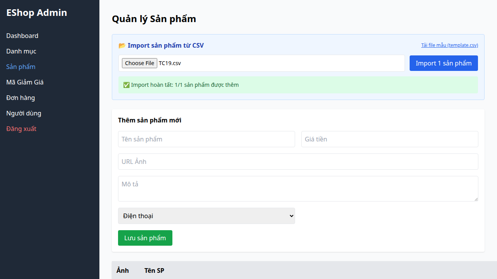

## Bug Description
The backend import endpoint does not validate the `price` field. It accepts negative numbers, zero, or even arbitrary strings like `"abc"` without throwing an error, leading to corrupted product pricing in the database.

## Steps to Reproduce
1. Upload a CSV with `price=-5000` or `price=abc`.
2. Submit the import.
3. Observe the backend response.

## Expected Result
The backend should validate `price > 0` and return an error for the specific row (e.g., "Giá không hợp lệ").

## Actual Result
The backend inserts the product into SQLite successfully.

## Environment
- SUT: Backend Express API
- OS: Linux

## Test Evidence
- Test Case: TC18, TC19, TC20, TC21 from FR-16
- Playwright Error: `Timeout 30000ms exceeded` waiting for `errorMessage` because the backend reports success.

## Severity
Medium — Allows completely invalid pricing data into the system, potentially impacting checkout logic.

### Evidence

