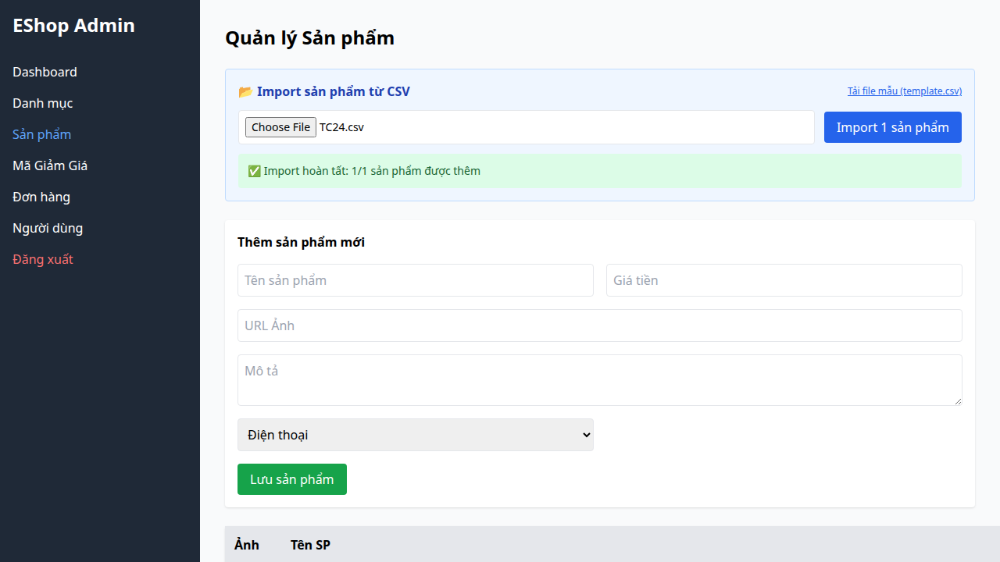

## Bug Description
The backend import endpoint does not enforce `category_id` as a required or valid field. If it's missing, empty, or a text string (which evaluates to NaN), the backend implicitly falls back to `category_id = 1` rather than rejecting the invalid row.

## Steps to Reproduce
1. Upload a CSV missing the `category_id` entirely or with `category_id="abc"`.
2. Submit the import.

## Expected Result
The backend should reject the row indicating the category ID is invalid or missing.

## Actual Result
The backend successfully imports the row and assigns it to category 1.

## Environment
- SUT: Backend Express API
- OS: Linux

## Test Evidence
- Test Case: TC24, TC25 from FR-16
- Playwright Error: `Timeout 30000ms exceeded` waiting for error.

## Severity
Low — Fails gracefully but masks data entry errors.

### Evidence

