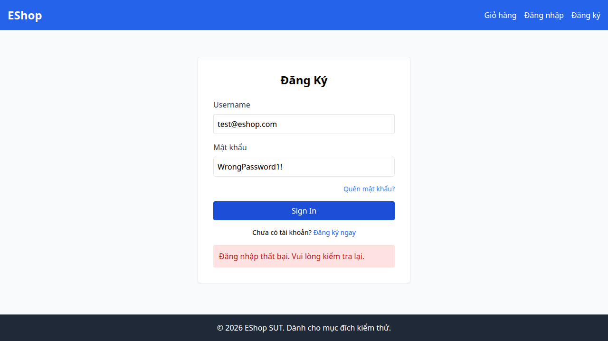

## Bug Description
Lỗi backend (server.js) tăng login_attempts 2 lần khi đăng nhập sai, dẫn đến tài khoản bị khóa chỉ sau 2 lần thử.

## Steps to Reproduce
1. Execute Test Case TC12, TC14, TC17, TC18, TC19 (FR-02).
2. Observe the failed validation.

## Expected Result
Hệ thống phải hoạt động đúng theo đặc tả yêu cầu.

## Actual Result
Bộ đếm login_attempts tăng 2 thay vì 1.

## Environment
- SUT: Web/Backend
- Browser: Chromium
- OS: Linux

## Test Evidence
- Test Case: TC12, TC14, TC17, TC18, TC19 (FR-02)
- Assertion Error: Test failed due to incorrect behavior.

## Severity
Critical

### Evidence

