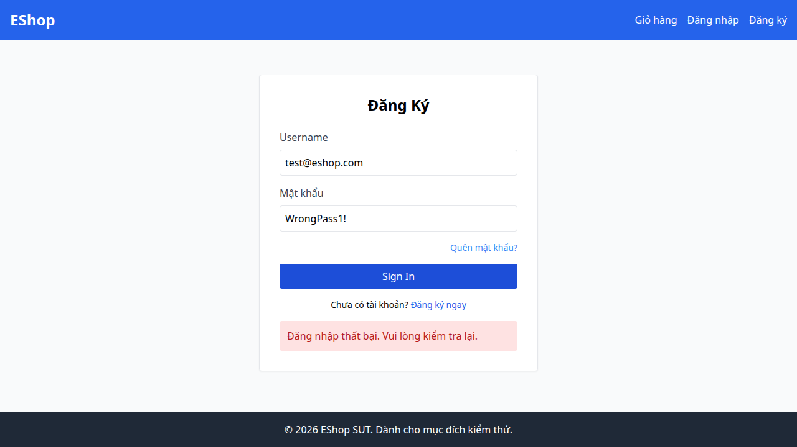

## Bug Description
Backend (server.js) cộng thời gian khóa `Date.now() + 180000` (3 phút) thay vì 30s theo đặc tả.

## Steps to Reproduce
1. Execute Test Case TC19 (FR-02).
2. Observe the failed validation.

## Expected Result
Hệ thống phải hoạt động đúng theo đặc tả yêu cầu.

## Actual Result
Thời gian khóa tài khoản là 180s thay vì 30s.

## Environment
- SUT: Web/Backend
- Browser: Chromium
- OS: Linux

## Test Evidence
- Test Case: TC19 (FR-02)
- Assertion Error: Test failed due to incorrect behavior.

## Severity
High

### Evidence

