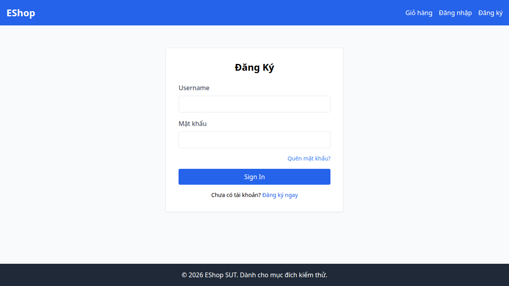

## Bug Description
Form báo lỗi render ngoài `<form>` và nằm dưới nút Submit, vi phạm FR-22.

## Steps to Reproduce
1. Execute Test Case TC26 (FR-02).
2. Observe the failed validation.

## Expected Result
Hệ thống phải hoạt động đúng theo đặc tả yêu cầu.

## Actual Result
Thông báo lỗi hiển thị SAU nút submit.

## Environment
- SUT: Web/Backend
- Browser: Chromium
- OS: Linux

## Test Evidence
- Test Case: TC26 (FR-02)
- Assertion Error: Test failed due to incorrect behavior.

## Severity
Medium

### Evidence

