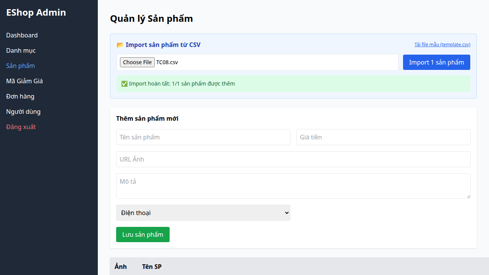

## Bug Description
Dùng fallback mapping `row['ten']` khiến cho file có header sai vẫn import qua mặt frontend nhưng làm hỏng dữ liệu các cột khác.

## Steps to Reproduce
1. Execute Test Case TC08 (FR-16).
2. Observe the failed validation.

## Expected Result
Hệ thống phải hoạt động đúng theo đặc tả yêu cầu.

## Actual Result
Frontend chấp nhận header sai do fallback mapping.

## Environment
- SUT: Web/Backend
- Browser: Chromium
- OS: Linux

## Test Evidence
- Test Case: TC08 (FR-16)
- Assertion Error: Test failed due to incorrect behavior.

## Severity
High

### Evidence

