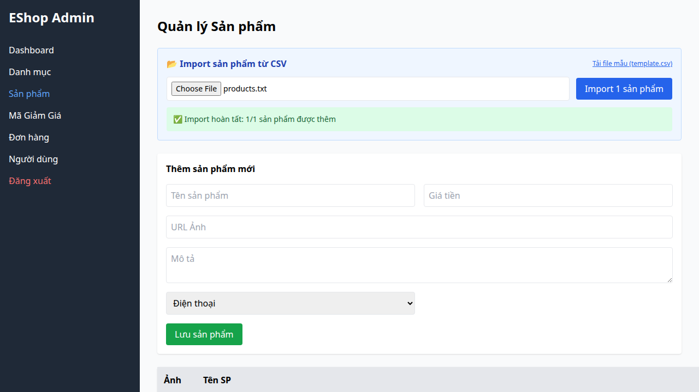

## Bug Description
Frontend dùng luôn dòng dữ liệu đầu tiên làm header, gây mất dữ liệu và xô lệch cột.

## Steps to Reproduce
1. Execute Test Case TC09 (FR-16).
2. Observe the failed validation.

## Expected Result
Hệ thống phải hoạt động đúng theo đặc tả yêu cầu.

## Actual Result
Không phát hiện thiếu header CSV.

## Environment
- SUT: Web/Backend
- Browser: Chromium
- OS: Linux

## Test Evidence
- Test Case: TC09 (FR-16)
- Assertion Error: Test failed due to incorrect behavior.

## Severity
High

### Evidence

