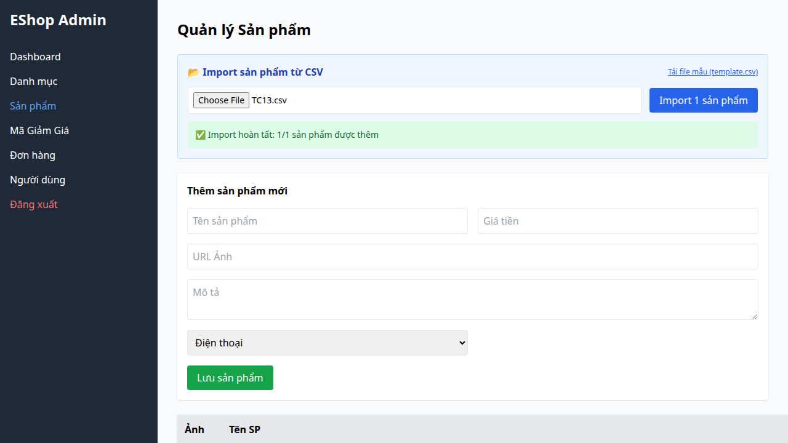

## Bug Description
Backend (server.js) không `.trim()` tên và không validate `name.length <= 255`.

## Steps to Reproduce
1. Execute Test Case TC13, TC14 (FR-16).
2. Observe the failed validation.

## Expected Result
Hệ thống phải hoạt động đúng theo đặc tả yêu cầu.

## Actual Result
Không validate tên sản phẩm (name rỗng, khoảng trắng, quá dài).

## Environment
- SUT: Web/Backend
- Browser: Chromium
- OS: Linux

## Test Evidence
- Test Case: TC13, TC14 (FR-16)
- Assertion Error: Test failed due to incorrect behavior.

## Severity
Medium

### Evidence

