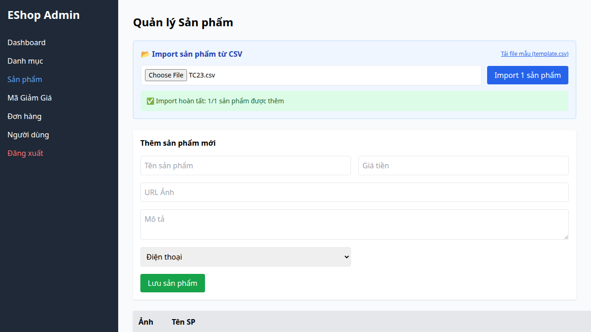

## Bug Description
DB thiếu khóa ngoại, backend không check DB nên insert category_id ảo (e.g. 9999) vẫn thành công.

## Steps to Reproduce
1. Execute Test Case TC23 (FR-16).
2. Observe the failed validation.

## Expected Result
Hệ thống phải hoạt động đúng theo đặc tả yêu cầu.

## Actual Result
Không validate category_id có thực sự tồn tại trong DB.

## Environment
- SUT: Web/Backend
- Browser: Chromium
- OS: Linux

## Test Evidence
- Test Case: TC23 (FR-16)
- Assertion Error: Test failed due to incorrect behavior.

## Severity
High

### Evidence

